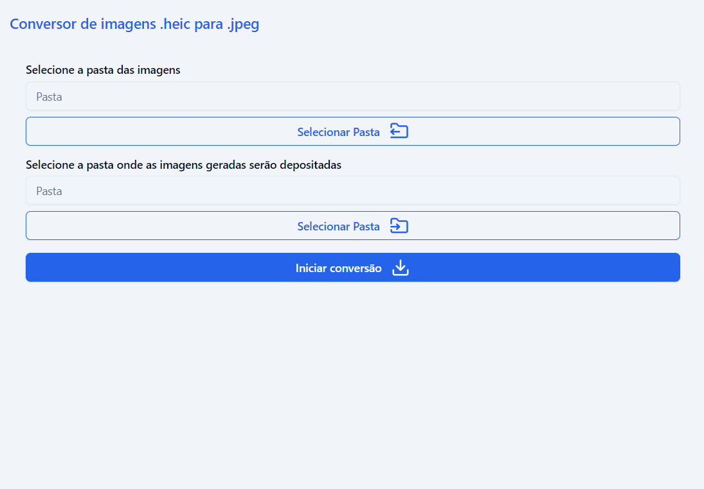

# convert-files

The convert-file is a desktop application built with Electron and React, utilizing the shadcn-ui library for interface creation.

This application is designed to retrieve all HEIC files from a selected directory, convert them to JPEG, and store them in another specified directory on the computer.



## Recommended IDE Setup

- [VSCode](https://code.visualstudio.com/) + [ESLint](https://marketplace.visualstudio.com/items?itemName=dbaeumer.vscode-eslint) + [Prettier](https://marketplace.visualstudio.com/items?itemName=esbenp.prettier-vscode)

## Project Setup

### Install

```bash
$ npm install
```

### Development

```bash
$ npm run dev
```

### Build

```bash
# For windows
$ npm run build:win

# For macOS
$ npm run build:mac

# For Linux
$ npm run build:linux
```
